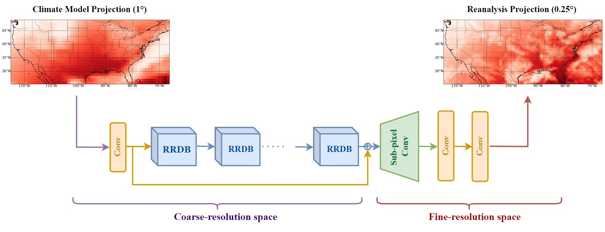

# EnhancedSD
PyTorch implementation of the paper - "EnhancedSD: Downscaling Solar Irradiance from Climate Model Projections", presented at NeurIPS - Tackling Climate Change with Machine Learning. 2022. 

[Project](https://www.climatechange.ai/papers/neurips2022/67)   |  [Paper](https://s3.us-east-1.amazonaws.com/climate-change-ai/papers/neurips2022/67/paper.pdf)   |  [Data](https://app.globus.org/file-manager?origin_id=943242d8-f344-48df-babe-98884ccf0633&origin_path=%2F)

## EnhancedSD Architecture 

## Requirements
- Python 3.8+
- pip install -r requirements.txt
